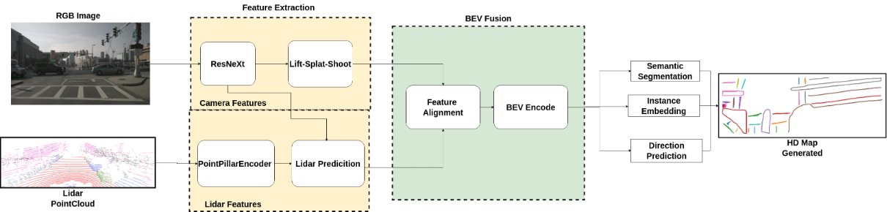

# Deep Learning Framework for BEV Perception

## Overview
The proposed framework employs a deep learning-based methodology for extracting features and understanding semantics from Bird’s-Eye View (BEV) images. The architecture is built upon a ResNeXt-50 backbone for hierarchical feature extraction, followed by a series of upsampling and convolutional layers to generate the final outputs. The system is optimized for instance segmentation, feature embedding, and motion direction prediction in an end-to-end manner. The ultimate goal is to improve perception and decision-making in autonomous systems by ensuring robust scene comprehension and accurate trajectory forecasting.

### System Overview
This approach enhances environmental perception for autonomous vehicles by integrating **camera and LiDAR data** into a **Bird’s-Eye View (BEV) representation**. The unified spatial representation allows for **accurate object detection, trajectory prediction, and instance segmentation**, effectively overcoming the limitations of single-sensor perception.

### Block Design

## Dataset - nuScenes

The framework is trained and evaluated on the **nuScenes dataset**, a large-scale autonomous driving dataset that provides **360-degree multimodal sensor data** collected from real-world urban environments. nuScenes contains:
- **1,000 scenes** captured across different weather and lighting conditions.
- **Six cameras** covering a full 360-degree field of view.
- **LiDAR point clouds** with 32-beam sensors providing dense 3D perception.
- **Radar data**, GPS, and IMU for additional localization and motion estimation.
- **Fully annotated 3D object detection and semantic segmentation labels.**

This dataset ensures robust training and benchmarking of the BEV perception model, particularly for **object detection, trajectory prediction, and scene understanding** in autonomous driving applications.

## Lift-Splat-Shoot (LSS) Approach

The system transforms multi-view camera images into a BEV representation, enabling spatial reasoning without LiDAR. It supports key autonomous driving tasks, including semantic segmentation, object detection, and trajectory prediction.

### Lift
Projects 2D image pixels into 3D space using estimated depth:

\[ X = d \cdot K^{-1} \begin{bmatrix} u \\ v \\ 1 \end{bmatrix} \]

where:
- \( d \) is the depth estimate.
- \( K \) is the camera intrinsic matrix.

### Splat
Maps 3D points onto a BEV grid through feature accumulation:

\[ (x_{bev}, y_{bev}) = \text{Projection}(X, Y, Z) \]

where \( (X, Y, Z) \) are the lifted 3D coordinates.

### Shoot
Processes the BEV grid using a CNN for tasks like segmentation, object detection, and motion forecasting:

\[ F_{output} = \text{CNN}(F_{bev}) \]

## LiDAR Feature Extraction – PointPillar Encoder

The PointPillar encoder efficiently transforms 3D LiDAR point cloud data into structured 2D “pillars,” eliminating the need for memory-intensive 3D convolutions.

### Architecture Overview
- **Feature Extraction:** A PointNet-based encoder captures local features from each pillar.
- **BEV Representation:** Encoded pillars are projected onto a 2D BEV grid for CNN-based processing.

The encoding process is defined as:

\[ F_P = f_{\theta} \left( \{(x_i, y_i, z_i, I_i)\}_{i=1}^{N_p} \right) \]

where:
- \( x_i, y_i, z_i \) – 3D coordinates of each LiDAR point.
- \( I_i \) – Intensity of the point.
- \( f_{\theta} \) – PointNet-based feature extractor.
- \( N_p \) – Number of points in a pillar.

This enables fast and effective LiDAR-based feature extraction, crucial for sensor fusion and high-definition (HD) map generation.

## LiDAR Prediction

LiDAR data provides precise 3D depth perception, addressing occlusion and depth ambiguity issues faced by camera-based approaches.

### Point Cloud Processing
Key structural features like road boundaries, lane markings, and obstacles are extracted from LiDAR point clouds to generate HD maps.

### Feature Encoding with BEV and PointPillars
- **BEV Representation:** Converts raw LiDAR data into a structured top-down view for enhanced spatial reasoning.
- **PointPillars Framework:** Encodes LiDAR data into a pillar-based grid, improving object detection and segmentation.

## Feature Fusion

To integrate RGB and LiDAR features, bilinear interpolation adjusts LiDAR features:

\[ \hat{F}_{LiDAR} = \sum_{i=1}^{H} \sum_{j=1}^{W} w_{ij} F_{LiDAR}(i, j) \]

where \( w_{ij} \) are interpolation weights. The final fused feature representation is computed as:

\[ F_{fusion} = \alpha \cdot F_{RGB} + \beta \cdot \hat{F}_{LiDAR} \]

where \( \alpha, \beta \) are learnable fusion weights.

## Results

